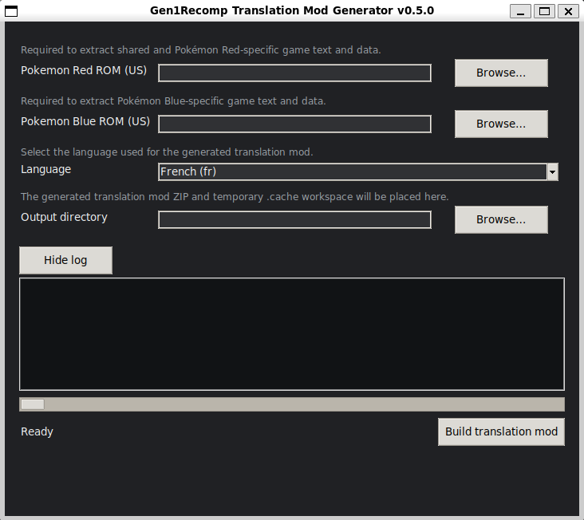

# Gen1Recomp translation mod generator

[](#contributors-)

This repository reproducibly generates multilingual `Gen1Recomp` translation
mods without storing a ROM or ROM extract. It currently produces two separate
artifacts per language:

- a universal Pokémon Red, Blue and Yellow mod, with a runtime-selected Yellow
  layer;
- a Pokémon Gold mod for Gen1Recomp's generation-2 runtime.

The artifacts have distinct mod IDs and filenames, so they can be installed
side by side.

> **AI-assisted development disclosure:** The repository and pipeline were
> developed with AI assistance. Changes are checked through automated tests,
> generated-artifact validation, and code review.

## Quick start

### Recommended: use the graphical application

Download the GUI executable for your platform from the
[latest release](https://github.com/thibautbus/gen1recomp-translation-mod-generator/releases/latest),
then select the target games and the corresponding ROM dumps:



1. Red, Blue and Yellow, or Gold;
2. your own canonical US ROM dumps for the selected games;
3. the target language and output directory.

The GUI writes a ready-to-import ZIP into the selected directory. It bundles
Python, Pillow and LuaJIT; network access is still required to download the
pinned Gen1Recomp and PokeCorpus inputs.

### Build from source with the CLI

Install Python 3.11+, Git, LuaJIT (`sudo apt install luajit` on
Ubuntu/Debian or `brew install luajit` on macOS), and Pillow
(`python -m pip install Pillow`). The builder checks prerequisites and prints
an installation hint; it never installs software silently. If LuaJIT is not
on `PATH`, set `MODKIT_LUAJIT` to its full executable path (it is a native
executable, not a Python package).

From the repository root:

```sh
python build_translation.py
```

Latin builds default to Fusion Pixel. Use
`python build_translation.py --font-profile pokemon` to select the optional
Pokemon Font profile. Substitute `python3`, `py -3`, or a virtual-environment
interpreter when appropriate.

The builder asks for the target games, canonical US ROM dumps and language. It
verifies the ROM fingerprints, asks before downloading pinned dependencies,
then extracts, translates, validates and packages the selected release in a
private ignored workspace.

The final file is `dist/translation-<lang>-<version>.zip` for RBY or
`dist/translation-<lang>-gen2-<version>.zip` for Gold; the command prints its
absolute path.

### Optional local path configuration

Copy [`config/rom_paths.example.toml`](config/rom_paths.example.toml) to the
ignored `config/rom_paths.toml` and edit it:

```toml
[rom]
red = "/absolute/path/to/PokemonRed.gb"
blue = "/absolute/path/to/PokemonBlue.gb"
yellow = "/absolute/path/to/PokemonYellow.gb"
gold = "/absolute/path/to/PokemonGold.gbc"
```

The three RBY entries are required for the universal build; `gold` is required
only for Gold. Relative paths resolve from this file and `~` expands, although
absolute paths are recommended. On Windows, use forward slashes or TOML
single-quoted paths such as `red = 'C:\Games\PokemonRed.gb'`. Configured files
are still checked for existence and SHA-1; declining one returns to the normal
prompt.

## Universal Yellow support

One ZIP per language works on Pokémon Red, Blue and Yellow US. Red/Blue data
lives in the common catalogs; entries whose source or translation differs in
Yellow are emitted into `lang/*_yellow.lua` and applied only when
`GameVersion.isYellow()`.

Shared translations are not duplicated. Missing matches keep the appropriate
ROM English text. The generated coverage report and
`.cache/audit/yellow/<language>.json` retain the full shared/versioned/Yellow-only
breakdown. Yellow-specific manual translations live in
`overrides/<language>/rby/yellow_engine.json`.

## Pokémon Gold support

Gold is published separately as `translation-<lang>-gen2`. It covers dialogue,
Pokédex entries, named ROM catalogs and engine strings matched from production
Gen 2 callsites. Missing or ambiguous matches remain in English.

Before packaging, headless generation-2 gates verify that the translated
values reach the Gold registries. These checks do not replace an in-game smoke
test before release.

## Legal inputs and privacy

Use dumps from your own original US cartridges:

| Game | Expected SHA-1 |
| --- | --- |
| Red | `ea9bcae617fdf159b045185467ae58b2e4a48b9a` |
| Blue | `d7037c83e1ae5b39bde3c30787637ba1d4c48ce2` |
| Yellow | `cc7d03262ebfaf2f06772c1a480c7d9d5f4a38e1` |
| Gold | `d8b8a3600a465308c9953dfa04f0081c05bdcb94` |

The pipeline verifies these fingerprints and never downloads, provides or
redistributes ROMs, patches or copyrighted text extracts. Generated data,
worksheets and reports remain under ignored `.cache/` paths and are not
packaged. Keep ROMs and the ignored `config/rom_paths.toml` private.

## Languages and fonts

English is the source language and runtime fallback. Supported targets and
font profiles are:

| Target languages | Releases | Default font | Optional font |
| --- | --- | --- | --- |
| `fr`, `de`, `es`, `it` | RBY and Gold | Fusion Pixel Latin, 10px | Pokemon Font, 8px |
| `ja-Hrkt` | RBY and Gold | Fusion Pixel Japanese, 8px | — |
| `ko` | Gold only | Fusion Pixel Hangul, 10px | — |

The optional Pokemon Font is more compact, but translated text can still
overflow fixed-width interfaces.
Macros and interface chrome remain tile-rendered. Each mod packages only the
selected TTF and its applicable license notices.

## Translation coverage

### Red, Blue and Yellow

The ZIP is universal, but ROM coverage is reported separately for Red/Blue
and Yellow:

- `ROM aggregate` is the release metric. It combines the six effective ROM
  catalogs with 179 shared runtime entries (types, species kinds, literal
  handlers, demo names and ROM-derived engine templates). Therefore
  `3281 = 3102 + 179` for Red/Blue and `3405 = 3226 + 179` for Yellow.
- `RBY-related engine strings` covers engine keys used by original RBY
  gameplay and interfaces.

Engine metrics are informational: unmatched or ambiguous entries keep the
engine's English fallback.

| Target | Red/Blue ROM aggregate | Yellow ROM aggregate | RBY-related engine strings |
| --- | ---: | ---: | ---: |
| `fr` | 3281/3281 (100%) | 3405/3405 (100%) | 256/256 (100%) |
| `de` | 3281/3281 (100%) | 3405/3405 (100%) | 256/256 (100%) |
| `es` | 3281/3281 (100%) | 3405/3405 (100%) | 256/256 (100%) |
| `it` | 3281/3281 (100%) | 3405/3405 (100%) | 256/256 (100%) |
| `ja-Hrkt` | 3281/3281 (100%) | 3405/3405 (100%) | 256/256 (100%) |

The ROM aggregates exclude extracted labels that do not render visible text.
Reviewed exceptions are recorded in
[`yellow_coverage_exceptions.json`](config/rby/yellow_coverage_exceptions.json).
Full per-key scope, matching strategy and fallback provenance remain available in
the generated coverage report and
[`engine_scope.json`](config/rby/engine_scope.json).

### Gold

Gold is built as a separate generation-2 artifact:

- `Gold ROM aggregate` combines dialogue, Pokédex entries and the named ROM
  catalogs. Its denominator excludes 14 markup-only records with no visible
  prose.
- `Gold-related engine strings` covers the 218 engine keys used by at least
  one production Gen 2 callsite.

The generated report retains the dialogue/catalog breakdown and per-key
provenance. Future unresolved entries will keep their original English text.

| Target | Gold ROM aggregate | Gold-related engine strings |
| --- | ---: | ---: |
| `fr` | 4452/4452 (100%) | 218/218 (100%) |
| `de` | 4452/4452 (100%) | 218/218 (100%) |
| `es` | 4452/4452 (100%) | 218/218 (100%) |
| `it` | 4452/4452 (100%) | 218/218 (100%) |
| `ja-Hrkt` | 4452/4452 (100%) | 218/218 (100%) |
| `ko` | 4452/4452 (100%) | 218/218 (100%) |

### Other engine strings

The remaining engine keys are reported separately below. They are keys used by
neither RBY nor Gold, so their denominator is the residual scope:
`951 - (256 + 218 - 8) = 485`. The numerator counts keys translated in at
least one of the two artifacts; this is a project-level metric, not a claim
that every key is present in both games.

| Target | Other engine strings |
| --- | ---: |
| `fr` | 111/485 (22.89%) |
| `de` | 111/485 (22.89%) |
| `es` | 109/485 (22.47%) |
| `it` | 111/485 (22.89%) |
| `ja-Hrkt` | 110/485 (22.68%) |
| `ko` | 31/485 (6.39%) |

The denominator is calculated as follows: `951` total engine keys, minus the
`256` RBY-related keys and the `218` Gold-related keys, plus back the `8` keys
shared by both scopes so they are subtracted only once. The resulting residual
scope is `485` keys.

These values use the pinned ROMs, corpus snapshots and Gen1Recomp revision
`1598f349`; regenerate them whenever one of those inputs changes.

## Translation provenance

Every translated engine string remains traceable:

| Origin | Meaning | Recorded in |
| --- | --- | --- |
| Automatic match | Exact, normalized, or structural match proved by the generator. | Generation report |
| Deterministic anchor | Reliable PokeCorpus qid, composition, or extraction rule. | `config/{rby,gold}/semantic_anchors.json` |
| Human-reviewed RBY anchor | Contextual or language-specific extraction reviewed by a maintainer; text still comes from PokeCorpus. | `config/rby/semantic_anchor_decisions.json` |
| Human-reviewed Gold pointer | Ambiguous ROM pointer resolved to a reviewed PokeCorpus qid. | `config/gold/pointer_decisions.json` |
| Reviewed placeholder exception | Official localized wording legitimately adds or omits a runtime value such as the player name or an item quantity. This records no translated text and does not disable the audit; each exception is scoped to a language, ROM pointer, corpus QID, and exact audit message. | `config/gold/placeholder_decisions.json` |
| Manual corpus correction | A maintainer corrects one selected-language corpus translation without changing the upstream corpus. Entries are indexed by qid. | `overrides/<language>/rby/corpus.json` |
| Manual translation — engine contract gap | PokeCorpus has the text, but Gen1Recomp merges contexts or hides required parameters. | `overrides/<language>/{rby,gold}/engine.json`, `reason: "engine-contract-gap"` |
| Manual translation — engine original | Engine-specific text with no compatible ROM source. | `overrides/<language>/{rby,gold}/engine.json`, `reason: "engine-original"` |
| Editorial correction | Deliberately preferred engine formulation. | `overrides/<language>/rby/engine.json`, `reason: "editorial-correction"` |
| Manual translation — Yellow-only engine text | Engine-authored, Yellow-exclusive text (Surfing Pikachu minigame HUD) with no PokeCorpus source; applied only when `GameVersion.isYellow()`. | `overrides/<language>/rby/yellow_engine.json`, `reason: "yellow-only-engine-text"` |
| Known limitation | Active anchor/override knowingly imperfect in a context or language; a status, not an origin. | Anchor metadata or override provenance |
| English fallback | No sufficiently reliable translation; runtime keeps English. | Generation report |

Generated coverage reports are the authoritative inventory of unmatched and
ambiguous strings. Every manual override must explain its source and accepted
limitations; otherwise the English fallback is preferred.

## Windows/Linux standalone executables

The GitHub Actions workflow builds CLI and graphical Tkinter executables for
Windows x64 and Linux x86_64:

- `gen1recomp-translation-mod-generator-<version>-<cli|gui>-windows-x64.exe`
- `gen1recomp-translation-mod-generator-<version>-<cli|gui>-linux-x86_64.tar.gz`

Windows users can run the downloaded EXE directly. Linux builds target Ubuntu
22.04 (glibc) and compatible newer systems; extract the selected archive and
run its binary:

```sh
tar -xzf gen1recomp-translation-mod-generator-<version>-gui-linux-x86_64.tar.gz
chmod +x gen1recomp-translation-mod-generator-<version>-gui-linux-x86_64
./gen1recomp-translation-mod-generator-<version>-gui-linux-x86_64
```

Standalone builds verify their pinned downloads and never bundle or upload
ROMs. The CLI stores its cache in the current directory; the GUI uses the
selected output directory. Keep ROMs and `config/rom_paths.toml` outside the
application bundle.

## Maintainer reference

### Data flow and matching

```text
resolve release -> verify ROMs -> prepare pinned inputs -> extract and match
-> generate -> validate -> inspect and publish archive
```

Text resolution is deterministic:

```text
explicit override > semantic anchor > exact > normalized
> structural placeholder match > empty entry (runtime English fallback)
```

Game-specific configuration lives under `config/rby/` and `config/gold/`;
language overrides follow the same split under `overrides/<language>/`.

| Configuration | Purpose |
| --- | --- |
| `config/rby/engine_scope.json` | RBY coverage classification for engine strings. |
| `config/rby/terminology_anchors.json` | Evidence for corpus terminology used by RBY. |
| `config/rby/literal_handlers.json` | Documented RBY extraction gaps. |
| `config/shared/engine_manifest.json` | Pinned engine revision and complete string universe shared by the releases. |

The semantic anchors and reviewed decisions are described in the
`Translation provenance` section above.
Gold identifies its production strings directly from Gen 2 source subtrees.
Missing or ambiguous evidence always falls back to English. Private review
candidates never become executable configuration automatically.
`strict_engine` requires the engine catalog and scaffold to be present, not
fully translated.

### Module map

| Area | Modules | Responsibility |
| --- | --- | --- |
| Entry points and policy | `cli.py`, `builder.py`, `gui.py`, `orchestration.py`, `specs.py` | Resolve release requests and dispatch the command, interactive and GUI flows. |
| Inputs and workspace | `project.py`, `dependencies.py`, `rom_paths.py`, `roms.py` | Resolve paths, verify private ROMs and prepare pinned dependencies. |
| Corpus model | `corpus.py`, `model.py`, `align.py`, `worksheet.py`, `tokens.py` | Parse parallel corpora, align qids and preserve control-token contracts. |
| RBY generation | `join.py`, `generate.py`, `literals.py`, `yellow.py`, `yellow_audit.py`, `mod.py` | Join Red/Blue catalogs, build the Yellow layer and emit the universal mod. |
| Gold generation | `gold_text.py`, `gold_join.py`, `gold_index_join.py`, `gold_engine.py`, `gold_mod.py` | Join GoldSilver to pointer/index catalogs, engine strings and the Gen 2 artifact. |
| Engine strings | `engine.py`, `engine_scope.py` | Match the versioned engine catalog and classify production callsites. |
| Validation and audits | `validate.py`, `disassembly_audit.py`, `engine_backlog.py` | Enforce release gates and produce private diagnostic reports. |

`build_translation.py` is the normal entry point. Intermediate and audit files
stay under `.cache/`.

### Audit commands

Disassembly audit:

```sh
python scripts/pipeline.py audit-disassemblies
```

This writes private comparison reports under `.cache/audit/`. Never publish
them: they can contain copyrighted text and local paths.

Engine backlog:

```sh
python scripts/pipeline.py engine-backlog --language fr
```

This records unresolved keys, callsites, fallback reasons and qid candidates
without modifying anchors, overrides or catalogs. It requires a matching
cached coverage/catalog snapshot.

For all languages (default `fr,de,es,it,ja-Hrkt`):

```sh
python scripts/pipeline.py engine-backlog-matrix
```

This produces the cross-language backlog matrix under
`.cache/audit/engine-backlog/`.

### Release builds

Build standalone artifacts locally with:

```powershell
./packaging/build_windows_executable.ps1
```

```sh
./packaging/build_linux_executable.sh
```

Tag pushes matching `v<version>` validate the version and publish all four
CLI/GUI artifacts. `workflow_dispatch` builds them without publishing. The
workflow compiles pinned LuaJIT, validates both front ends and inspects each
archive before upload.

### Remaining limitations

- Automated gates validate data loading and packaging, not rendering; releases
  still need in-game smoke tests.
- Some engine strings remain in English, as shown by the coverage tables.
- Translated text can exceed fixed UI widths with either font profile.
- Battle stat arguments can remain English because Gen1Recomp passes raw
  `ATTACK`/`DEFENSE`/`SPEED`/`SPECIAL` values to localized templates.
- RBY type names are replaced at draw time by exact string match, so a nickname
  identical to an English type name is translated too.
- The desktop launcher uses a separate renderer and is outside the content
  mod's translation hooks.
- Gold-specific upstream engine gaps are tracked in
  [docs/upstream-fixes.md](docs/upstream-fixes.md).

## Credits

- [Gen1Recomp](https://github.com/bryanthaboi/gen1recomp) by [bryanthaboi](https://github.com/bryanthaboi), the native Lua / LÖVE2D recreation.
- [PokéCorpus](https://github.com/abcboy101/poke-corpus) by [abcboy101](https://github.com/abcboy101), the multilingual translation corpus.
- [pokemon-font](https://github.com/cooljeanius/pokemon-font) v1.8.2, the Pokemon Font clone by Superpencil, sourced from the fork maintained by [cooljeanius](https://github.com/cooljeanius), available as the optional Latin profile.
- [Fusion Pixel Font](https://github.com/TakWolf/fusion-pixel-font) by [TakWolf](https://github.com/TakWolf), used by the recommended Latin profile and the Japanese profile.

## Contributors ✨

Thanks go to these wonderful people:

<!-- ALL-CONTRIBUTORS-LIST:START - Do not remove or modify this section -->
<table>
  <tr>
    <td align="center" valign="top" width="14.28%"><a href="https://github.com/thibautbus"><br /><sub><b>thibautbus</b></sub></a><br /><a href="https://github.com/thibautbus/gen1recomp-translation-mod-generator/commits?author=thibautbus" title="Code">💻</a> <a href="https://github.com/thibautbus/gen1recomp-translation-mod-generator/commits?author=thibautbus" title="Documentation">📖</a> <a href="https://github.com/thibautbus/gen1recomp-translation-mod-generator/commits?author=thibautbus" title="Maintenance">🚧</a></td>
    <td align="center" valign="top" width="14.28%"><a href="https://github.com/antoniman31"><br /><sub><b>AntoniMan31</b></sub></a><br /><a href="https://github.com/thibautbus/gen1recomp-translation-mod-generator/pull/10" title="Bug fixes">🐛</a> <a href="https://github.com/thibautbus/gen1recomp-translation-mod-generator/commits?author=antoniman31" title="Code">💻</a></td>
  </tr>
</table>

<!-- ALL-CONTRIBUTORS-LIST:END -->
