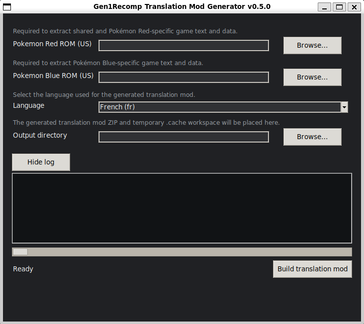

# Gen1Recomp translation mod generator

[](#contributors-)

This repository reproducibly generates multilingual `Gen1Recomp` translation
mods without storing a ROM or ROM extract. Each supported language gets up to
four separate mods (Korean gets the Gold, Silver and Crystal one only):

- a universal Pokémon Red, Blue and Yellow mod, with a runtime-selected Yellow
  layer;
- a Pokémon Gold, Silver and Crystal mod for Gen1Recomp's generation-2 runtime;
- a Pokémon FireRed and LeafGreen mod for Gen1Recomp's generation-3 (game3) runtime;
- a Pokémon Ruby, Sapphire and Emerald mod for the same runtime.

The artifacts have distinct mod IDs and filenames, so they can be installed
side by side.

> **Bring your own ROMs.** This repository contains no ROM, no ROM extract and
> no game asset, and the pipeline never downloads, provides or redistributes
> any. Every build starts from dumps of your own original cartridges, which it
> checks against the canonical SHA-1 fingerprints before reading them (see
> [Legal inputs and privacy](#legal-inputs-and-privacy)). What it extracts
> from them stays in the private, ignored `.cache/` directory and is never
> packaged.

> **AI-assisted development disclosure:** The repository and pipeline were
> developed with AI assistance. Changes are checked through automated tests,
> generated-artifact validation, and code review.

## What the mods translate

Each mod replaces the game's English text with the official text of the
target language's own carts, taken from PokeCorpus and joined to the US ROM
you supply:

- the dialogue, signs, Pokédex entries and battle messages;
- the Pokémon, move, item, trainer and trainer class names;
- the menus, prompts and Gen1Recomp's own interface strings, Easy Chat words
  included;
- the metric Pokédex: the official heights and weights in metres and
  kilograms, as the European and Japanese carts print them, instead of feet,
  inches and pounds;
- the cross-game Union Room Gen1Recomp adds to every generation, worded with
  each cart's own Union Room terms.

Text with no reliable official source keeps its English, and the coverage
tables below show how much that is.

### Known gaps

Some text stays in English until Gen1Recomp lets a mod reach it.
[docs/upstream-fixes.md](docs/upstream-fixes.md) tracks each gap, game by
game:

- Gold, Silver and Crystal: the item descriptions in the PACK and Buena's
  password words.
- FireRed and LeafGreen: the Pokédex categories and descriptions, the help
  system, the quest log and the naming keyboard's layout.
- Ruby and Sapphire: the secret base, roulette, trainer card labels, diploma,
  berry tag, PokéNav and Battle Tower records screens.
- Emerald: berries, decorations, the Battle Pyramid's prompts and the Battle
  Frontier lounges' messages.
- Every generation-3 release: a handful of interface strings with no cart
  row, and a few official lines that print a value the runtime does not fill
  (see the coverage tables).
- The Union Room: the messages explaining why a Pokémon cannot cross to the
  other game.
- Every game: the mod manager's own screens.

## Quick start

### Recommended: use the graphical application

Download the GUI executable for your platform from the
[latest release](https://github.com/thibautbus/gen1recomp-translation-mod-generator/releases/latest)
(see [the standalone executables](#windows-linux-and-macos-standalone-executables)
for the file to pick), then select the target games and the corresponding ROM
dumps:



1. Red, Blue and Yellow, Gold, Silver and Crystal, FireRed and LeafGreen, or
   Ruby, Sapphire and Emerald;
2. your own canonical US ROM dumps for the selected games (see
   [Supported games](#supported-games) for which ones each mod needs);
3. the target language and output directory.

The GUI writes a ready-to-import ZIP into the selected directory; then
[install it in the game](#installing-the-mod-in-the-game). The GUI bundles
Python, Pillow and LuaJIT; network access is still required to download the
pinned inputs (Gen1Recomp, PokeCorpus, pret's symbol tables and charmaps, and
the fonts). Verified downloads are reused on the next run.

To build from source instead, see
[Build from source with the CLI](#build-from-source-with-the-cli).

## Windows, Linux and macOS standalone executables

The GitHub Actions workflow builds CLI and graphical Tkinter executables for
Windows x64, Linux x86_64, and macOS Intel/Apple Silicon:

- `gen1recomp-translation-mod-generator-<version>-<cli|gui>-windows-x64.exe`
- `gen1recomp-translation-mod-generator-<version>-<cli|gui>-linux-x86_64.tar.gz`
- `gen1recomp-translation-mod-generator-<version>-cli-macos-<x86_64|arm64>.tar.gz`
- `gen1recomp-translation-mod-generator-<version>-gui-macos-<x86_64|arm64>.zip`

Windows users can run the downloaded EXE directly. Linux builds target Ubuntu
22.04 (glibc) and compatible newer systems; extract the selected archive and
run its binary:

```sh
tar -xzf gen1recomp-translation-mod-generator-<version>-gui-linux-x86_64.tar.gz
chmod +x gen1recomp-translation-mod-generator-<version>-gui-linux-x86_64
./gen1recomp-translation-mod-generator-<version>-gui-linux-x86_64
```

On macOS, select `arm64` for Apple Silicon or `x86_64` for Intel. Extract the
GUI ZIP and double-click `gen1recomp-translation-mod-generator-gui.app` in
Finder. The CLI archive still runs from Terminal:

```sh
tar -xzf gen1recomp-translation-mod-generator-<version>-cli-macos-arm64.tar.gz
./gen1recomp-translation-mod-generator-<version>-cli-macos-arm64
```

The macOS builds are not notarized. If macOS blocks the app because its
developer cannot be verified, first confirm that the archive
came from this project's GitHub release. Then try to open the app once, go
to **System Settings → Privacy & Security**, and select **Open Anyway**. See
[Apple's instructions](https://support.apple.com/en-gb/102445). Do not bypass
a warning that the binary is damaged or will harm your computer.

Standalone builds verify their pinned downloads and never bundle or upload
ROMs. The CLI stores its cache in the current directory; the GUI uses the
selected output directory. Keep ROMs and `config/rom_paths.toml` outside the
application bundle.

## Supported games

Each mod needs the ROMs its row lists; where a row offers two editions (Red or
Blue), either one is enough:

| Mod | ROMs to supply | File |
| --- | --- | --- |
| Red, Blue and Yellow | Red or Blue, and Yellow | `translation-<lang>-<version>.zip` |
| Gold, Silver and Crystal | Gold or Silver, and Crystal | `translation-<lang>-gen2-<version>.zip` |
| FireRed and LeafGreen | FireRed or LeafGreen | `translation-<lang>-gen3-<version>.zip` |
| Ruby, Sapphire and Emerald | Ruby or Sapphire (revision 1.0, 1.1 or 1.2), and Emerald | `translation-<lang>-gen3-rse-<version>.zip` |

### Universal Yellow support

One ZIP per language works on Pokémon Red, Blue and Yellow US. Red and Blue
share byte-identical dialogue text and pointer tables, so either one builds
the same mod. Yellow is a mandatory companion ROM: its differing text ships as
a layer applied only on a Yellow save, and shared translations are not
duplicated.

### Pokémon Gold, Silver and Crystal support

Gold, Silver and Crystal are published together as `translation-<lang>-gen2`.
Gold's and Silver's own text (dialogue, Pokédex entries, names and engine
strings) is built from either cart. Crystal is a mandatory companion ROM, the
same way Yellow is for the universal RBY mod: its dialogue sits at different
addresses and has its own PokeCorpus collection, so it ships as a layer
applied only on a Crystal save, while the names and engine strings Crystal
shares with Gold and Silver apply unchanged. PokeCorpus has no Korean Crystal
collection, so in the Korean mod Crystal's own dialogue stays in English. The
manifest declares `"gold"`, `"silver"` and `"crystal"`, so the same mod loads
on any of the three editions' saves.

### Pokémon FireRed and LeafGreen support

FireRed and LeafGreen (US, v1.0) are published as one `translation-<lang>-gen3`
mod for `fr`, `de`, `es`, `it` and `ja-Hrkt`, built from either cart: the
build keys the other edition's text through pret's symbol tables, so a mod
built from FireRed or from LeafGreen is the same. At the pinned Gen1Recomp
v0.3.63, most FireRed screens draw their text from the cart, so the mod
translates them with the official rows, in the cart's own fonts (Japanese
included). [docs/gen3-pipeline.md](docs/gen3-pipeline.md) explains the join
and the release gate; the [known gaps](#known-gaps) list what stays English.

### Pokémon Ruby, Sapphire and Emerald support

Ruby, Sapphire and Emerald are published as one `translation-<lang>-gen3-rse`
mod for `fr`, `de`, `es`, `it` and `ja-Hrkt`, the way Gold, Silver and
Crystal share one: select **Ruby, Sapphire and Emerald (generation 3)** in the
GUI or the interactive CLI, then a Ruby or Sapphire ROM (whichever you own, of
any English revision: 1.0, 1.1 or 1.2) and the Emerald ROM. Emerald (US,
v1.0) is a mandatory companion ROM, like Crystal: its text, its catalogs and
its cart rows differ from Ruby and Sapphire's. The mod carries one layer per
game and per Ruby/Sapphire text layout, picked at runtime from the running game, so it
works on either edition and every revision; Emerald's trainers are named as
the European carts name them. [docs/gen3-pipeline.md](docs/gen3-pipeline.md)
explains the layers, the joins and the release gate.

## Legal inputs and privacy

Use dumps from your own original cartridges (US, or the English carts sold in
Europe for Ruby and Sapphire 1.1 and 1.2):

| Game | Expected SHA-1 |
| --- | --- |
| Red | `ea9bcae617fdf159b045185467ae58b2e4a48b9a` |
| Blue | `d7037c83e1ae5b39bde3c30787637ba1d4c48ce2` |
| Yellow | `cc7d03262ebfaf2f06772c1a480c7d9d5f4a38e1` |
| Gold | `d8b8a3600a465308c9953dfa04f0081c05bdcb94` |
| Silver | `49b163f7e57702bc939d642a18f591de55d92dae` |
| Crystal | `f4cd194bdee0d04ca4eac29e09b8e4e9d818c133` |
| FireRed | `41cb23d8dccc8ebd7c649cd8fbb58eeace6e2fdc` |
| LeafGreen | `574fa542ffebb14be69902d1d36f1ec0a4afd71e` |
| Ruby 1.0 | `f28b6ffc97847e94a6c21a63cacf633ee5c8df1e` |
| Ruby 1.1 | `610b96a9c9a7d03d2bafb655e7560ccff1a6d894` |
| Ruby 1.2 | `5b64eacf892920518db4ec664e62a086dd5f5bc8` |
| Sapphire 1.0 | `3ccbbd45f8553c36463f13b938e833f652b793e4` |
| Sapphire 1.1 | `4722efb8cd45772ca32555b98fd3b9719f8e60a9` |
| Sapphire 1.2 | `89b45fb172e6b55d51fc0e61989775187f6fe63c` |
| Emerald | `f3ae088181bf583e55daf962a92bb46f4f1d07b7` |

The pipeline verifies these fingerprints and never downloads, provides or
redistributes ROMs, patches or copyrighted text extracts. Generated data,
worksheets and reports remain under ignored `.cache/` paths and are not
packaged. Keep ROMs and the ignored `config/rom_paths.toml` private.

## Languages and fonts

English is the source language and runtime fallback. Supported targets and
font profiles are:

| Target languages | Releases | Default font | Optional font |
| --- | --- | --- | --- |
| `fr`, `de`, `es`, `it` | RBY, Gold/Silver/Crystal, FireRed/LeafGreen, Ruby/Sapphire/Emerald | Fusion Pixel Latin, 10px (RBY, GSC); the cart's own font (FireRed/LeafGreen, Ruby/Sapphire/Emerald) | Pokemon Font, 8px (RBY, GSC) |
| `ja-Hrkt` | RBY, Gold/Silver/Crystal, FireRed/LeafGreen, Ruby/Sapphire/Emerald | Fusion Pixel Japanese, 8px (RBY, GSC); the cart's own Japanese fonts (FireRed/LeafGreen, Ruby/Sapphire/Emerald) | — |
| `ko` | Gold/Silver/Crystal only (Crystal's own dialogue stays in English) | Fusion Pixel Hangul, 10px | — |

The font profile applies to the RBY and Gold/Silver/Crystal mods only; the
generation-3 mods always use the cart's own fonts. The GUI offers the choice,
and the CLI takes `--font-profile pokemon`. The optional Pokemon Font is more
compact, but translated text can still overflow fixed-width interfaces.
Macros and interface chrome remain tile-rendered. Each mod packages only the
selected TTF and its applicable license notices.

## Build from source with the CLI

Install Python 3.11+, Git, LuaJIT (`sudo apt install luajit` on
Ubuntu/Debian or `brew install luajit` on macOS), and Pillow
(`python -m pip install Pillow`). The builder checks prerequisites and prints
an installation hint; it never installs software silently. If LuaJIT is not
on `PATH`, set `MODKIT_LUAJIT` to its full executable path (it is a native
executable, not a Python package).

From the repository root:

```sh
python build_translation.py
```

Add `--font-profile pokemon` to select the optional Pokemon Font profile.
Substitute `python3`, `py -3`, or a virtual-environment interpreter when
appropriate.

The builder asks for the target games, canonical US ROM dumps and language. It
verifies the ROM fingerprints, asks before downloading pinned dependencies,
then extracts, translates, validates and packages the selected release in a
private ignored workspace. The final file is written under `dist/` with the
name given in [Supported games](#supported-games), and the command prints its
absolute path.

### Optional local path configuration

Copy [`config/rom_paths.example.toml`](config/rom_paths.example.toml) to the
ignored `config/rom_paths.toml` and edit it:

```toml
[rom]
red = "/absolute/path/to/PokemonRed.gb"
blue = "/absolute/path/to/PokemonBlue.gb"
yellow = "/absolute/path/to/PokemonYellow.gb"
gold = "/absolute/path/to/PokemonGold.gbc"
silver = "/absolute/path/to/PokemonSilver.gbc"
crystal = "/absolute/path/to/PokemonCrystal.gbc"
firered = "/absolute/path/to/PokemonFireRed.gba"
leafgreen = "/absolute/path/to/PokemonLeafGreen.gba"
ruby = "/absolute/path/to/PokemonRuby.gba"
sapphire = "/absolute/path/to/PokemonSapphire.gba"
emerald = "/absolute/path/to/PokemonEmerald.gba"
```

List only the ROMs you own. As in [Supported games](#supported-games), each
mod reads `red` or `blue` plus `yellow`; `gold` or `silver` plus `crystal`;
`firered` or `leafgreen`; `ruby` or `sapphire` plus `emerald`. Of each "or"
pair, either entry alone is enough.
Relative paths resolve from this file and `~` expands, although absolute paths
are recommended. On Windows, use forward slashes or TOML single-quoted paths
such as `red = 'C:\Games\PokemonRed.gb'`. Configured files are still checked
for existence and SHA-1; declining one returns to the normal prompt.

## Installing the mod in the game

In Gen1Recomp's launcher, open the **MODS** tab, choose **Import mod .zip** and
pick the generated ZIP, or drop the ZIP onto the game window. The game unpacks
it into the `mods` folder of its save directory (on Windows, normally
`%APPDATA%\pokemon-love2d\mods\`). The game reads only unpacked mod folders,
so to install by hand, extract the ZIP into its own folder there rather than
copying the ZIP itself.

## Translation coverage

The tables measure what each mod ships, not what the current runtime
displays, at Gen1Recomp revision `7ab2f865` (v0.3.63) with the pinned ROMs and
corpus snapshots; what is not shipped keeps its English.
[docs/coverage.md](docs/coverage.md) defines each metric and breaks down what
is left.

### Red, Blue and Yellow

The ZIP is universal, but ROM coverage is reported separately for Red/Blue and
Yellow; the engine strings are those original RBY gameplay and interfaces use.

| Target | Red Blue ROM aggregate | Yellow ROM aggregate | RBY-related engine strings |
| --- | ---: | ---: | ---: |
| `fr` | 3286/3286 (100%) | 3400/3400 (100%) | 425/425 (100%) |
| `de` | 3286/3286 (100%) | 3400/3400 (100%) | 425/425 (100%) |
| `es` | 3286/3286 (100%) | 3400/3400 (100%) | 425/425 (100%) |
| `it` | 3286/3286 (100%) | 3400/3400 (100%) | 425/425 (100%) |
| `ja-Hrkt` | 3286/3286 (100%) | 3397/3400 (99.91%) | 425/425 (100%) |

### Gold, Silver and Crystal

Crystal's own dialogue is measured separately from Gold and Silver's text.
Korean's gaps are Crystal's own text, which has no Korean collection.

| Target | Gold and Silver ROM aggregate | Gold and Silver-related engine strings | Crystal dialogue coverage |
| --- | ---: | ---: | ---: |
| `fr` | 6839/6839 (100%) | 993/993 (100%) | 3994/3994 (100%) |
| `de` | 6839/6839 (100%) | 993/993 (100%) | 3994/3994 (100%) |
| `es` | 6839/6839 (100%) | 993/993 (100%) | 3994/3994 (100%) |
| `it` | 6839/6839 (100%) | 993/993 (100%) | 3994/3994 (100%) |
| `ja-Hrkt` | 6839/6839 (100%) | 993/993 (100%) | 3994/3994 (100%) |
| `ko` | 5796/6839 (84.75%) | 993/993 (100%) | 0/3994 (0%) |

### FireRed and LeafGreen

FireRed and LeafGreen land on the same figures. The engine strings reach
1934/1946 (99.38%) in every language; the twelve left are rows Gen1Recomp
added without a cart row.

| Target | FireRed/LeafGreen ROM aggregate |
| --- | ---: |
| `fr` | 10926/10934 (99.93%) |
| `de` | 10924/10934 (99.91%) |
| `es` | 10924/10934 (99.91%) |
| `it` | 10925/10934 (99.92%) |
| `ja-Hrkt` | 10873/10936 (99.42%) |

### Ruby and Sapphire

Every edition and revision lands on the same figures. The engine strings reach
2546/2552 (99.76%) in every language.

| Target | Ruby/Sapphire ROM aggregate |
| --- | ---: |
| `fr` | 15272/15373 (99.34%) |
| `de` | 15254/15373 (99.23%) |
| `es` | 15304/15373 (99.55%) |
| `it` | 15269/15373 (99.32%) |
| `ja-Hrkt` | 15243/15375 (99.14%) |

### Emerald

The engine strings reach 2678/2685 (99.74%) in every language.

| Target | Emerald ROM aggregate |
| --- | ---: |
| `fr` | 17716/17721 (99.97%) |
| `de` | 17710/17721 (99.94%) |
| `es` | 17714/17721 (99.96%) |
| `it` | 17716/17721 (99.97%) |
| `ja-Hrkt` | 17579/17723 (99.19%) |

### Other engine strings

The engine keys neither RBY nor Gold and Silver use (a residual scope of 1307
keys), translated in at least one of those two mods; a project-level metric.

| Target | Other engine strings |
| --- | ---: |
| `fr` | 191/1307 (14.61%) |
| `de` | 191/1307 (14.61%) |
| `es` | 189/1307 (14.46%) |
| `it` | 190/1307 (14.54%) |
| `ja-Hrkt` | 187/1307 (14.31%) |
| `ko` | 100/1307 (7.65%) |

## Remaining limitations

- Automated gates validate data loading and packaging, not rendering; releases
  still need in-game smoke tests.
- Text Gen1Recomp keeps out of a mod's reach stays in English: see the
  [known gaps](#known-gaps) and [docs/upstream-fixes.md](docs/upstream-fixes.md).
- Translated text can exceed fixed UI widths with either font profile.
- RBY type names are replaced at draw time by exact string match, so a nickname
  identical to an English type name is translated too.
- The desktop launcher uses a separate renderer and is outside the content
  mod's translation hooks.

## Maintainer reference

### Data flow and matching

```text
resolve release -> verify ROMs -> prepare pinned inputs -> extract and match
-> generate -> validate -> inspect and publish archive
```

Text resolution is deterministic:

```text
explicit override > semantic anchor > exact > normalized
> structural placeholder match > empty entry (runtime English fallback)
```

Game-specific configuration lives under `config/rby/`, `config/gsc/`,
`config/frlg/` and `config/rse/`; language overrides follow the same split
under `overrides/<language>/`. Further reference:

- [docs/provenance.md](docs/provenance.md): where every translation comes from
  (each override `reason`) and what each configuration file records;
- [docs/gen3-pipeline.md](docs/gen3-pipeline.md): the generation-3 joins,
  layers and release gates, and how to regenerate the engine scopes;
- [docs/coverage.md](docs/coverage.md): the coverage metrics;
- [docs/upstream-fixes.md](docs/upstream-fixes.md): the Gen1Recomp gaps, game
  by game.

### Module map

The pipeline is split like `config/`: one package per game, and
`pipeline/shared/` for what several games use. `tools/` and `tests/` follow
the same split.

| Package | Modules | Responsibility |
| --- | --- | --- |
| `pipeline/shared/` | `cli.py`, `builder.py`, `gui.py`, `orchestration.py`, `specs.py` | Resolve release requests and dispatch the command, interactive and GUI flows. |
| `pipeline/shared/` | `project.py`, `dependencies.py`, `rom_paths.py`, `roms.py`, `subprocess_run.py`, `engine_profile.py` | Resolve paths, verify private ROMs and prepare pinned dependencies. |
| `pipeline/shared/` | `corpus.py`, `model.py`, `align.py`, `worksheet.py`, `tokens.py`, `generate.py` | Parse parallel corpora, align qids, preserve control-token contracts and write Lua. |
| `pipeline/shared/` | `engine_manifest.py`, `strings_harvest.py`, `engine.py` | The pinned engine string universe, the `Strings()`/RomText callsite harvester, and the engine-string join Red/Blue and Gold share. |
| `pipeline/shared/` | `mod_assets.py`, `validate.py`, `leak_audit.py` | What every mod ships besides its catalogs (fonts, load priority), and the release gates. |
| `pipeline/shared/` | `pokedex_metrics.py` | The official Pokédex heights and weights in metres and kilograms (pret pokeemerald's `pokedex_entries.h`, pinned as `[pret.pokedex_metrics]`), which every mod patches into each species. |
| `pipeline/rby/` | `build.py`, `join.py`, `mod.py`, `yellow.py`, `yellow_audit.py`, `literals.py` | Build the Red/Blue and Yellow mod: join the catalogs, resolve literal handlers, write the mod and its Yellow layer. |
| `pipeline/rby/` | `engine_scope.py`, `engine_backlog.py`, `disassembly_audit.py` | Classify the engine strings for Red/Blue, report the private backlog and audit the localized disassemblies. |
| `pipeline/gsc/` | `text.py`, `join.py`, `index_join.py`, `localized_registries.py`, `trainer_names.py`, `engine.py`, `mod.py` | Join GoldSilver to pointer/index catalogs and engine strings, and emit the Gen 2 artifact. |
| `pipeline/gsc/` | `crystal_mod.py`, `crystal_registries.py`, `crystal_strings.py` | The Crystal layer of the Gen 2 artifact. |
| `pipeline/gen3/` | `family.py`, `text.py`, `join.py`, `engine_scope.py`, `mod.py` | What every generation-3 family shares: its corpus, pret charmap/symbols and text IR dialect, the address-to-label, catalog and engine joins, the engine scope generator and the mod helpers. |
| `pipeline/frlg/` | `editions.py`, `start_menu.py`, `audit.py`, `mod.py` | The FireRed/LeafGreen artifact: the other edition's text keyed through pret's symbols, its edition layers, start menu, release gate and the game3 hardcoded-text audit. |
| `pipeline/rse/` | `join.py`, `emerald.py`, `european.py`, `mod.py` | The Ruby, Sapphire and Emerald artifact: Ruby/Sapphire's join and the layouts keyed through pret's symbols, Emerald's join and European trainers, the layered mod, its release gate and build. |
| `tools/gsc/`, `tools/frlg/`, `tools/rse/` | `extract.lua`, `gate*.lua`, `measure_*.py` | ROM extractors and release gates run under LuaJIT, and the Gold join measurements. |

`build_translation.py` is the normal entry point. Intermediate and audit files
stay under `.cache/`.

### Audit commands

Disassembly audit:

```sh
python scripts/pipeline.py audit-disassemblies
```

This writes private comparison reports under `.cache/audit/`. Never publish
them: they can contain copyrighted text and local paths.

Engine backlog:

```sh
python scripts/pipeline.py engine-backlog --language fr
```

This records unresolved keys, callsites, fallback reasons and qid candidates
without modifying anchors, overrides or catalogs. It requires a matching
cached coverage/catalog snapshot.

For all languages (default `fr,de,es,it,ja-Hrkt`):

```sh
python scripts/pipeline.py engine-backlog-matrix
```

This produces the cross-language backlog matrix under
`.cache/audit/engine-backlog/`.

### Release builds

Build standalone artifacts locally with:

```powershell
./packaging/build_windows_executable.ps1
```

```sh
./packaging/build_linux_executable.sh
./packaging/build_macos_executable.sh
```

Tag pushes matching `v<version>` validate the version and publish all eight
CLI/GUI artifacts. `workflow_dispatch` builds them without publishing. The
workflow compiles pinned LuaJIT, validates both front ends and inspects each
archive before upload.

## Credits

- [Gen1Recomp](https://github.com/bryanthaboi/gen1recomp) by [bryanthaboi](https://github.com/bryanthaboi), the native Lua / LÖVE2D recreation.
- [PokéCorpus](https://github.com/abcboy101/poke-corpus) by [abcboy101](https://github.com/abcboy101), the multilingual translation corpus.
- [pokemon-font](https://github.com/cooljeanius/pokemon-font) v1.8.2, the Pokemon Font clone by Superpencil, sourced from the fork maintained by [cooljeanius](https://github.com/cooljeanius), available as the optional Latin profile.
- [Fusion Pixel Font](https://github.com/TakWolf/fusion-pixel-font) by [TakWolf](https://github.com/TakWolf), used by the recommended Latin profile, the Japanese profile, and the Korean profile (Gold, Silver and Crystal only).

## Contributors ✨

Thanks go to these wonderful people:

<!-- ALL-CONTRIBUTORS-LIST:START - Do not remove or modify this section -->
<table>
  <tr>
    <td align="center" valign="top" width="14.28%"><a href="https://github.com/thibautbus"><br /><sub><b>thibautbus</b></sub></a><br /><a href="https://github.com/thibautbus/gen1recomp-translation-mod-generator/commits?author=thibautbus" title="Code">💻</a> <a href="https://github.com/thibautbus/gen1recomp-translation-mod-generator/commits?author=thibautbus" title="Documentation">📖</a> <a href="https://github.com/thibautbus/gen1recomp-translation-mod-generator/commits?author=thibautbus" title="Maintenance">🚧</a></td>
    <td align="center" valign="top" width="14.28%"><a href="https://github.com/antoniman31"><br /><sub><b>AntoniMan31</b></sub></a><br /><a href="https://github.com/thibautbus/gen1recomp-translation-mod-generator/pull/10" title="Bug fixes">🐛</a> <a href="https://github.com/thibautbus/gen1recomp-translation-mod-generator/commits?author=antoniman31" title="Code">💻</a></td>
  </tr>
</table>

<!-- ALL-CONTRIBUTORS-LIST:END -->
